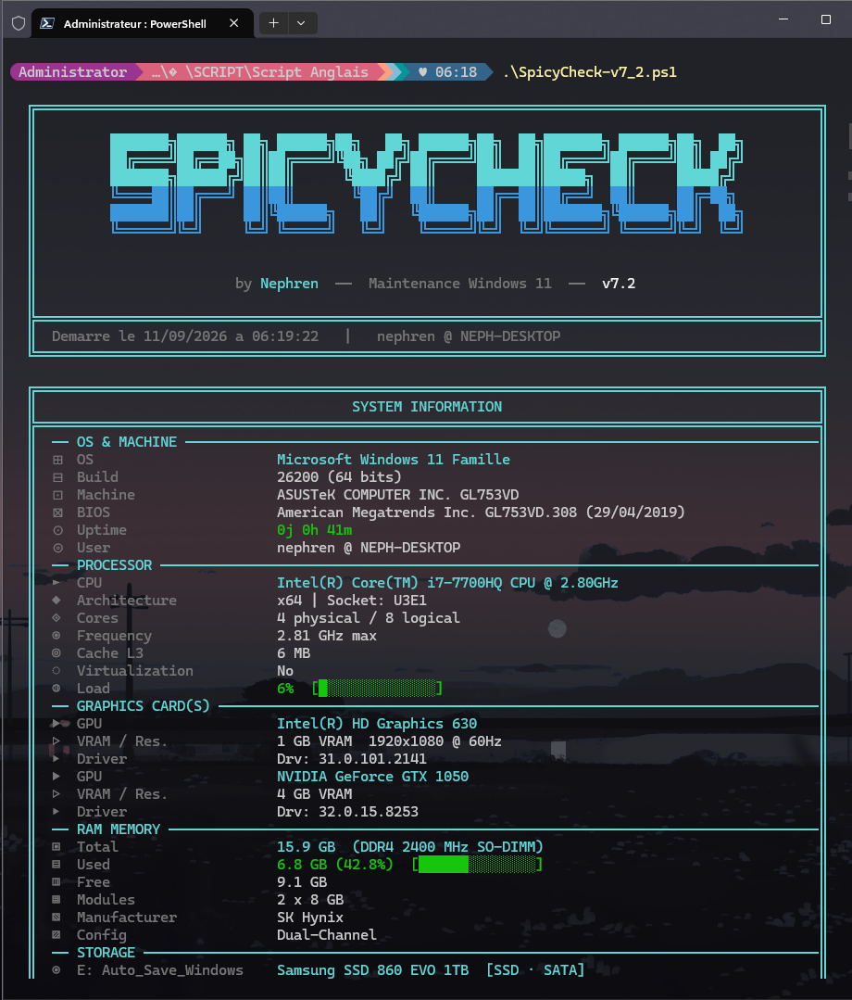
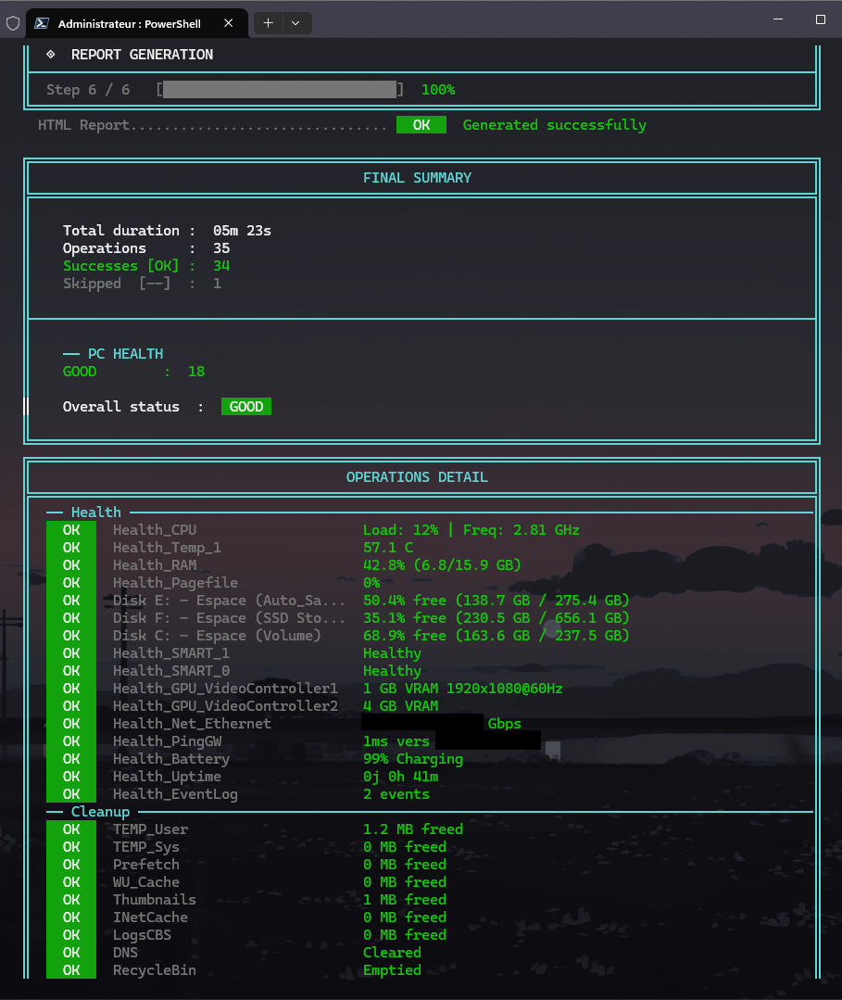
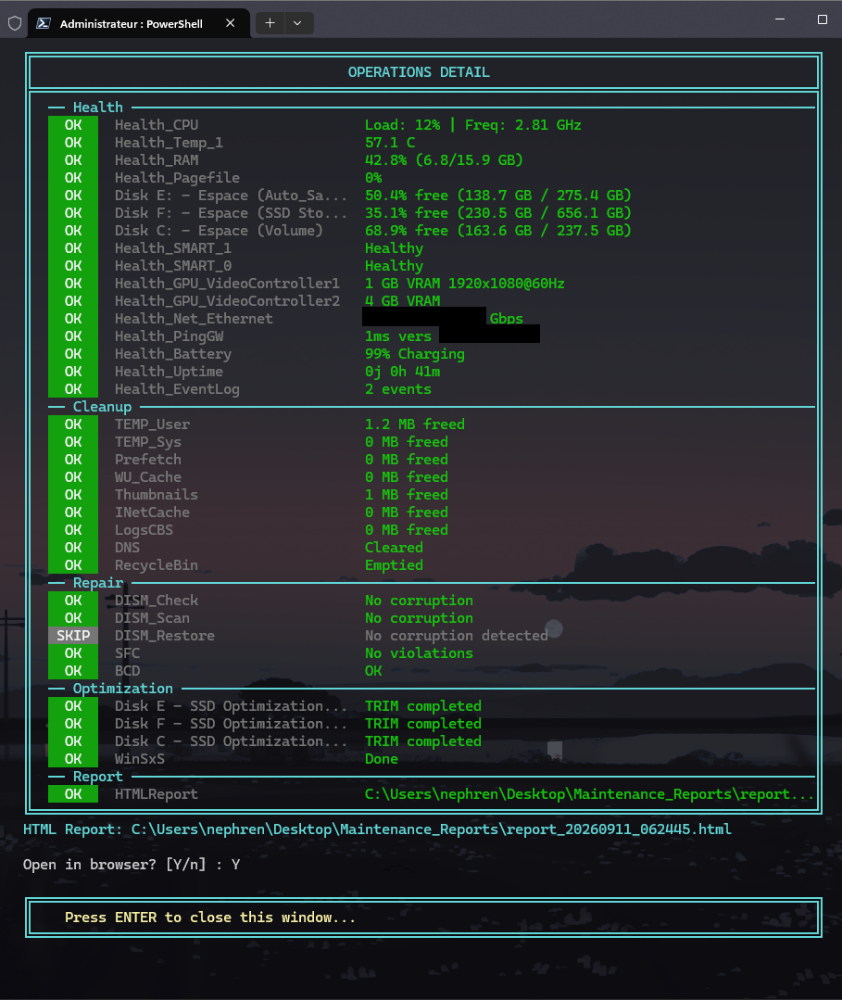
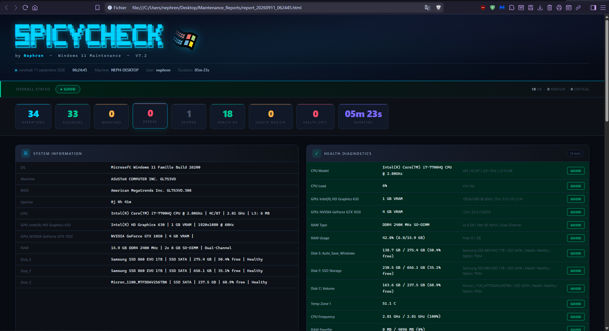

# SpicyCheck

🇫🇷 [Version française](README_FRENCH.md)

An all-in-one Windows 11 maintenance script, one command: a full health diagnostic (CPU, RAM, disks, network, battery, uptime, event logs), temp-file cleanup, system repair via DISM/SFC/BCD, disk optimization (TRIM/defrag), and an HTML dashboard report — all tracked live in the console with ASCII-box framing and progress bars, fastfetch-style.

> Every health verdict (`GOOD`/`MEDIUM`/`CRITICAL`) rests on an explicit threshold documented below, never a vague impression. DISM/SFC corruption detection is bilingual (French/English) and actively cleans the raw output of both binaries, which can be captured with encoding artifacts (null bytes, mis-decoded accented characters) depending on console configuration — a trap that, without this cleanup, can silently make a corrupted-file detection disappear.

---

## Screenshots

<p align="center">
  
  
</p>
<p align="center">
  
  
</p>

---

## Language

As of v7.2, the script's code, console output, HTML report, and log file are entirely in English, regardless of which Windows language edition it runs on. This is a UI/code change only — the script still works identically on both English- and French-language Windows machines:

- **DISM/SFC corruption detection stays bilingual.** These tools reply in the OS's own language, so the detection patterns match French and English output alike (see [Technical notes](#technical-notes-bilingual-dismsfc-detection-and-output-cleaning)).
- **The HTML report's date/time display follows the OS locale**, not the script's language — day and month names (`Get-Date -Format 'dddd dd MMMM yyyy'`) render in whichever language Windows itself is set to.

If you're running an older copy of SpicyCheck (pre-v7.2) that still used French parameter names, folder names, and console text, see [Command-line parameters](#command-line-parameters) and [Generated reports](#generated-reports) below for what changed.

---

## Table of contents

- [Screenshots](#screenshots)
- [Language](#language)
- [Overview](#overview)
- [How the health diagnostic works](#how-the-health-diagnostic-works)
- [The 6 steps](#the-6-steps)
- [Technical notes: bilingual DISM/SFC detection and output cleaning](#technical-notes-bilingual-dismsfc-detection-and-output-cleaning)
- [Requirements](#requirements)
- [First run](#first-run-step-by-step)
- [Command-line parameters](#command-line-parameters)
- [Generated reports](#generated-reports)
- [Multi-machine deployment](#multi-machine-deployment)
- [Troubleshooting](#troubleshooting)

---

## Overview

`SpicyCheck-v7_2.ps1` runs a complete Windows 11 maintenance cycle in a single pass: system info display (fastfetch-style), a health diagnostic (~16 independent checks), temp-file/cache cleanup, system repair (DISM CheckHealth → ScanHealth → conditional RestoreHealth → SFC scannow → bootloader verification), disk optimization (TRIM for SSDs, defrag for HDDs), then generation of an HTML dashboard report.

Every step is logged (`maintenance_<timestamp>.log`) and every operation is classified by status (`OK` / `WARN` / `ERROR` / `SKIP`), shown live in the console with color coding and reproduced identically in the final HTML report.

---

## How the health diagnostic works

Unlike a weighted-score system (see `Check-Security_Win11` elsewhere in this suite), SpicyCheck uses a simple, deliberately conservative "worst case wins" logic: the overall status shown (`GOOD`/`MEDIUM`/`CRITICAL`) equals the single worst individual status observed across all health checks. One component in `CRITICAL` is enough to push the entire diagnostic to `CRITICAL`, no matter how many other components are healthy.

**Thresholds applied per check:**

| Check | MEDIUM | CRITICAL |
|---|---|---|
| CPU load | > 70% | > 90% |
| CPU frequency (throttling) | < 40% of max clock | — |
| Temperature (per zone) | > 75°C | > 90°C |
| RAM usage | > 75% | > 90% |
| Pagefile | > 50% | > 80% |
| Free disk space | < 20% | < 10% |
| SMART health (per disk) | `Warning` | anything other than `Healthy`/`Warning` |
| Gateway ping | > 80 ms | > 200 ms |
| Battery (on discharge) | < 40% | < 20% |
| Uptime | > 30 days | > 60 days |
| System/Application events (1h, Error/Critical level) | > 5 | > 20 |

This same diagnostic feeds both the score shown live in the console during step 2/6, **and** the final HTML report and the end-of-run console summary — both now draw from the same data source (`$Script:Health`), guaranteeing that what you see during the run is exactly what the report archives.

---

## The 6 steps

<details>
<summary><strong>1 · System information (fastfetch-style banner)</strong></summary>

Displays a full panel: OS/build, machine/BIOS, uptime, CPU (model, architecture, cores, frequency, cache, virtualization, load), GPU(s) (VRAM, resolution, driver), RAM (total, used, modules, manufacturer, channel configuration), storage (per drive letter: space, SSD/HDD/bus type, health, filesystem), network (active interface, IP), temperatures. Also feeds part of the health checks.
</details>

<details>
<summary><strong>2 · Health diagnostic</strong></summary>

~16 independent checks: CPU (load + frequency), temperature zones, RAM (usage + pagefile), each disk (free space + individual SMART health), each GPU, each active network interface + gateway ping, battery (if present), system uptime, event log (errors/critical from the last hour). Ends with an "Overall health status" box showing the aggregated status.
</details>

<details>
<summary><strong>3 · System cleanup</strong></summary>

User TEMP, system TEMP (`C:\Windows\Temp`), Prefetch (`.pf` files only — the folder itself is never deleted), Windows Update cache (`SoftwareDistribution\Download`), thumbnail/icon cache (`thumbcache_*.db`/`iconcache_*.db`), Internet cache (`INetCache`), CBS logs (`.log`/`.cab` under `Windows\Logs\CBS`), DNS cache flush, Recycle Bin empty. Each step reports the space freed.
</details>

<details>
<summary><strong>4 · System repair</strong></summary>

Strict sequence: `DISM /CheckHealth` → `DISM /ScanHealth` → **if and only if** corruption was detected by either preceding step, `DISM /RestoreHealth` (otherwise this step is marked `SKIP`, never run needlessly) → `SFC /scannow` → bootloader check (`bcdedit /enum`). DISM's corruption detection and SFC's 4-outcome classification (no violations / repaired / not repairable / operation failed) are both bilingual French/English and tolerant of console encoding artifacts — see the technical section below.
</details>

<details>
<summary><strong>5 · Disk optimization</strong></summary>

For every mounted volume with a drive letter: TRIM (`Optimize-Volume -ReTrim`) if an SSD is detected, classic defragmentation if an HDD, a generic `Optimize-Volume` pass if the type couldn't be determined. Finishes with a WinSxS cleanup (`DISM /StartComponentCleanup`).
</details>

<details>
<summary><strong>6 · Report generation</strong></summary>

A single HTML report (see [Generated reports](#generated-reports)) containing: an overall-status banner, summary cards (operations/successes/warnings/errors/skipped + health breakdown + duration), a "System Information" panel, a "Health Diagnostic" panel, and a full "Operations Detail" table grouped by section. Optional JSON export via `-ExportJSON`.
</details>

---

## Technical notes: bilingual DISM/SFC detection and output cleaning

Two pitfalls were identified and fixed during development, documented here to prevent regressions:

**1. Localization.** The output of `dism.exe` and `sfc.exe` is in the system's language. Detection based solely on English strings (`"repairable"`, `"did not find any integrity violations"`, etc.) never matches on a French-language Windows install — corruption could be detected by DISM without ever triggering `RestoreHealth`. All detections are now bilingual (`repairable|réparable`, `aucune violation`, etc.).

**2. Console encoding.** On some configurations, the output of `sfc.exe` (and occasionally `dism.exe`) is captured with a null byte interleaved between every character, and accented letters mis-decoded (a UTF-16LE artifact re-read through the OEM/CP437 codepage — `é` becomes `Ú`, `è` becomes `Þ`, etc.). Without cleanup, a regex that matches perfectly in testing can silently never match the machine's actual output, causing a critical detection to fall through to the generic `OK` status. The `ConvertTo-CleanOutput` function systematically cleans this output (stripping null bytes and control characters) before any pattern matching, across all 4 relevant DISM/SFC calls.

---

## Requirements

- Windows 11 (the script specifically targets `dism`, `sfc`, `bcdedit`, `defrag`, plus the `Storage`/`NetAdapter`/`NetTCPIP` cmdlets shipped with Windows 11).
- PowerShell 5.1 (built into Windows) or PowerShell 7+.
- Administrator rights (`#Requires -RunAsAdministrator` — the script refuses to start without it, no auto-elevation).
- `dism.exe`, `sfc.exe`, `bcdedit.exe`, `defrag.exe`, `ipconfig.exe` reachable on the `PATH`.
- If the script is digitally signed (recommended under `-ExecutionPolicy AllSigned`/`RemoteSigned`): the signing certificate must be trusted on the target machine.

---

## First run (step by step)

1. Copy `SpicyCheck-v7_2.ps1` to the target machine.

2. Open PowerShell **as Administrator** — the script requires elevation up front and does not self-elevate.

3. Run the self-test first — no files written, no system changes:

   ```powershell
   .\SpicyCheck-v7_2.ps1 -SelfTest
   ```

   Runs 36 internal assertions (utility functions, required binaries present, cmdlets/WMI classes queryable, reports folder writable, elevated session). Exit code `0` = all passed, `1` = at least one failure.

4. Run the full pass:

   ```powershell
   .\SpicyCheck-v7_2.ps1
   ```

   Watch the live progress through all 6 steps (`Step X / 6`) in the console, with color-coded detail for each operation. The repair phase (DISM ScanHealth especially) is usually the longest.

5. At the end, the console shows the "Final Summary" (duration, OK/WARN/ERROR counters, overall health status), followed by a detailed table of every operation.

6. The script prompts `Open in browser? [Y/n]` — answering `Y`/Yes (or just Enter) opens the generated HTML report directly.

7. For automated or repeated runs, use `-Silent` (see below) and check the HTML report afterwards.

---

## Command-line parameters

| Parameter | Description |
|---|---|
| `-SkipCleanup` | Skips step 3 (cleanup). |
| `-SkipRepair` | Skips step 4 (DISM/SFC/BCD). |
| `-SkipOptimization` | Skips step 5 (TRIM/defrag/WinSxS). |
| `-Silent` | Disables all console output (banner, progress, summary, browser prompt, final pause). Reports are still generated normally — built for scheduled-task use. |
| `-ExportJSON` | Also exports the full raw result set as JSON (`report_<timestamp>.json`). |
| `-SelfTest` | Runs the 36-assertion internal test suite then exits. No report generated, nothing changed on the system. Exit code `0`/`1`. |

**Examples:**

```powershell
.\SpicyCheck-v7_2.ps1 -SelfTest
.\SpicyCheck-v7_2.ps1
.\SpicyCheck-v7_2.ps1 -Silent -ExportJSON
.\SpicyCheck-v7_2.ps1 -SkipOptimization
```

---

## Generated reports

Every real run (excluding `-SelfTest`) writes to:

```
%USERPROFILE%\Desktop\Maintenance_Reports\
```

| File | Content |
|---|---|
| `report_<timestamp>.html` | Full dashboard: overall-status banner, summary cards, System Information panel, Health Diagnostic panel, full Operations Detail table grouped by section |
| `maintenance_<timestamp>.log` | Plain-text timestamped log of every operation, including the (cleaned) raw output of DISM/SFC — useful for after-the-fact troubleshooting |
| `report_<timestamp>.json` | Full JSON export of the complete result set (only with `-ExportJSON`) |

On an unhandled fatal error, a `MAINTENANCE_ERROR.txt` file is also written directly to the Desktop.

---

## Multi-machine deployment

1. **Distribute** the `.ps1` file to each target machine.

2. **Trust the signing certificate** if a strict execution policy is in place (`-ExecutionPolicy AllSigned`/`RemoteSigned`).

3. **Run `-SelfTest` first** on each machine to confirm the script itself is intact and that prerequisites (binaries, cmdlets, WMI classes) are available.

4. **Schedule via Windows Task Scheduler** with `-Silent`, running as Administrator (mandatory — no auto-elevation):

   | Field | Value |
   |---|---|
   | Program/script | `pwsh.exe` (or `powershell.exe`) |
   | Arguments | `-NoProfile -ExecutionPolicy Bypass -File "C:\Scripts\SpicyCheck-v7_2.ps1" -Silent` |
   | Run with highest privileges | Yes |

5. Reports and logs are **local to each machine**, written to the Desktop of the user running the task — nothing is centralized automatically. For a fleet-wide consolidated view, add a separate collection step (network share, log shipping) on top of this script.

6. Bilingual DISM/SFC detection covers French and English; if the fleet includes machines running a **third language**, manually verify (via `-SelfTest` followed by a real run and inspection of the `.log`) that DISM/SFC messages in that language are correctly recognized before rolling out broadly.

---

## Troubleshooting

<details>
<summary><strong>The script doesn't start at all</strong></summary>

It requires Administrator rights up front (`#Requires -RunAsAdministrator`) and does not self-elevate — right-click PowerShell and choose "Run as administrator", or launch from an already-elevated terminal.
</details>

<details>
<summary><strong>The HTML report's "Health Diagnostic" doesn't match what the console showed during the run</strong></summary>

Should no longer happen now that both views share the same data source. If a discrepancy is observed, compare the run's `.log` against the HTML report and report it — it's likely a regression.
</details>

<details>
<summary><strong>DISM ScanHealth finds corruption but RestoreHealth doesn't trigger</strong></summary>

Check the `DISM ScanHealth :` line in the `.log` and confirm the text actually contains `repairable` or `réparable`. If the message is in a language other than French or English, detection won't recognize it — see [Technical notes](#technical-notes-bilingual-dismsfc-detection-and-output-cleaning).
</details>

<details>
<summary><strong>SFC shows "Verification completed" instead of a precise status</strong></summary>

This is the expected fallback when none of the 4 known patterns (no violations / repaired / not repairable / operation failed) match — usually a sign of an unusual SFC message or an uncovered language. Inspect the `SFC :` line in the `.log` (already cleaned of null bytes) to identify the exact text.
</details>

<details>
<summary><strong>-SelfTest reports a failure</strong></summary>

Read the failing assertion's name directly in the console or `.log` — it points to a specific missing function, binary, or cmdlet, not to the machine's actual health status.
</details>

---

<sub>SpicyCheck — one-command Windows 11 maintenance, 16-check health diagnostic, bilingual DISM/SFC/BCD repair, 36-assertion self-test.</sub>
